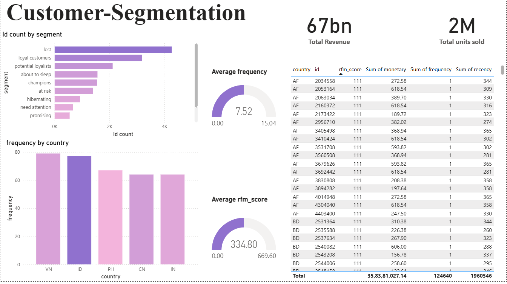

# 🧠 Customer Segmentation – Asia Sales Dashboard

This repository provides a complete Power BI solution for **customer segmentation** using **RFM (Recency, Frequency, Monetary) analysis** based on **Asia sales data**. It segments customers to support personalized marketing, retention strategies, and data-driven business decisions.

---

## 📂 Repository Contents

| File                         | Description                                                             |
| ---------------------------- | ----------------------------------------------------------------------- |
| `Customer-Segmentation.pbix` | Power BI report file with interactive customer segmentation dashboards. |
| `RFM_Asia.csv`               | Processed dataset with RFM scores and customer segments.                |
| `sales_asia.csv`             | Raw sales data used to derive RFM metrics.                              |
| `Screenshot (361).png`       | Preview of the Power BI dashboard.                                      |

---

## 🎯 Key Objectives

* Segment customers using RFM metrics
* Visualize customer value and retention risks
* Identify geographic sales trends across Asia
* Enable actionable insights for marketing and CRM

---

## 🔢 RFM Analysis Overview

**RFM stands for:**

* **Recency**: Days since the customer’s last purchase
* **Frequency**: Number of purchases made
* **Monetary**: Total revenue generated by a custome

---

## 📊 Dashboard Highlights

* **Total Revenue**: `67bn+`
* **Total Units Sold**: `2M+`
* **Average Frequency**: `7.52`
* **Average RFM Score**: `~335`

### Key Visuals:

* Bar chart: **Customer count by segment**
* Bar chart: **Frequency by country**
* Gauge visuals: **Average Frequency** & **RFM Score**
* Data Table: Customer-level RFM breakdown with recency, frequency, monetary totals
* Filters: Drill-down by **country**, **segment**, or **RFM score**

---

## 🚀 How to Use

### Prerequisites

* [Power BI Desktop](https://powerbi.microsoft.com/desktop/)

### Steps

1. Download or clone this repo.
2. Open `Customer-Segmentation.pbix` in Power BI Desktop.
3. Interact with visuals, apply filters, or extend the report.
4. Use `RFM_Asia.csv` and `sales_asia.csv` for your own analysis or updates.

---

## 🧩 Use Cases

* CRM strategies based on segment insights
* Targeted promotions for high-value or at-risk customers
* Market analysis by country or region
* Churn prediction and reactivation campaigns

---

## 🛠️ Customization Ideas

* Modify segmentation thresholds in Power Query
* Add time-based slicers for trend comparisons
* Integrate new regional data for broader insights
* Embed DAX measures for advanced KPIs

---

## 📜 License

This project is licensed under the MIT License. See the [LICENSE](LICENSE) file for details.

---

## 🙏 Acknowledgments

* Power BI Community
* Data modeling principles from RFM analytics
* Your interest in customer data insights!

---

## 🙋‍♀️ Author

Developed by **Marmik Gandhi** Feel free to connect:  
- GitHub: [@MarmikGandhi](https://github.com/MarmikGandhi)
- Email: [marmikgandhi@gamil.com](mailto:marmikgandhi@gamil.com)
- LinkedIn: [marmik-gandhi](https://www.linkedin.com/in/marmik-gandhi-006a55323/)
